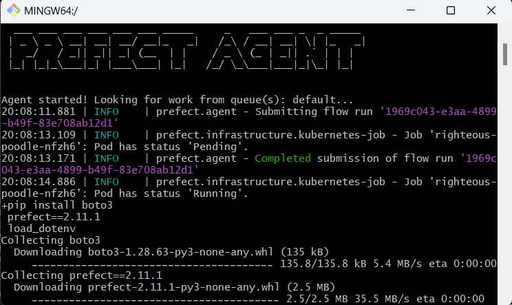
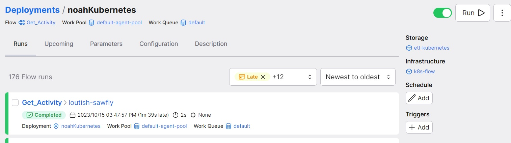
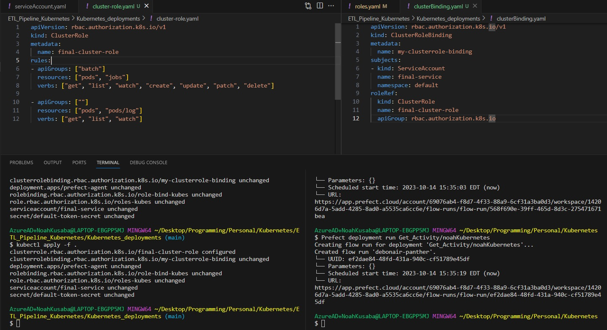
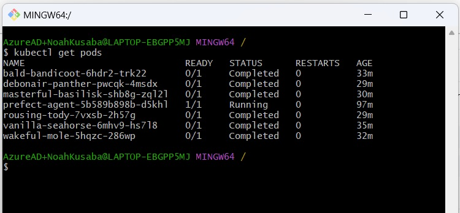
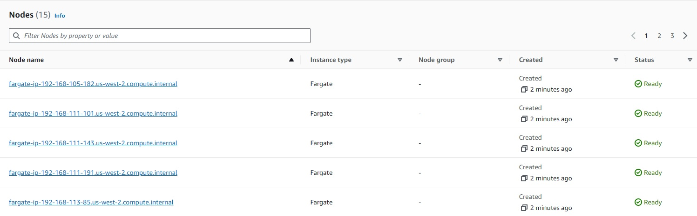

# Prefect - Kubernetes Deployment Pipeline
Repository to learn Kubernets & Prefect deployment patterns for ETL pipelines. 

# Features: 
    - Script: Calls API & emails output to personal email. 
    - Workflow Orchestration: Jobs deployed by Prefect, 
    - Hosting: AWS managed Kubernetes (EKS) deployed on Fargate serverless deployments 
        - Prefect Agent, deployed on EKS fargate, awaits jobs to be scheduled to work queue, then deploys to new fargate instance managed by EKS.
        - Kuberenetes hosting tested on (different hostings require different roles/cluster roles): 
            - CIVO Kubernetes
            - Local hosted with Minikube
            - AWS EKS (EC2 & Fargate)
            

Prefect Agent hosted on EKS-Fargate deploying job

# Steps:

- Setup Prefect Cloud: Create account, generate keys.

- Create Python code to run & instantiate as a Prefect @flow (main.py). 

- Create Prefect Storage & Kubernetes-Infastructure Blocks to designate deployment (k8_infra_setup.py).

- CI/CD: When code is pushed to the repository, Github Actions will update the python deployment in your prefect cloud. (You can designate as a CRONJOB here for Prefect to manage)

- Setup Kubernetes cluster (Use managed service or host locally), and generate kubeconfg file to connect.

- Dockerize Prefect Agent, which moniters a job work queue to deploys jobs on Kubernetes pods.  

- Setup Kubernetes deployment (AWS EKS + Fargate), and authenticate kubectl to connect.  

- Create Kubernetes deployment and configuration yaml files to deploy the Prefect-Agent Docker Image onto Kubernetes. Also necessary to give the Prefect-Agent pod on Kubernetes permissions to launch additional pods on Kubernetes when necessary. 

- Deploy yaml files to kubernetes, then trigger Prefect deployments via CRON schedule or "Prefect deployment run Flow-Name/workspace"

#

